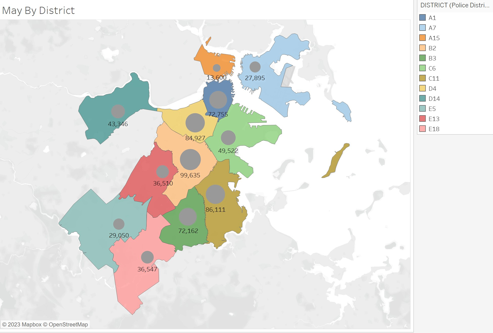
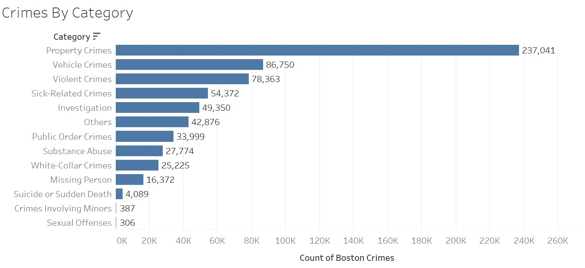
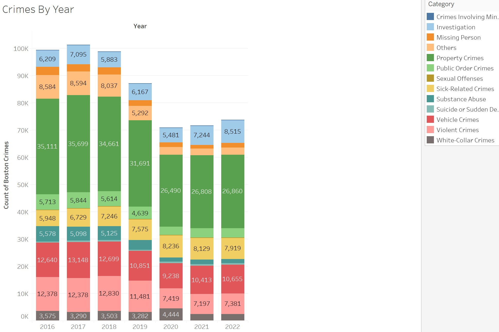
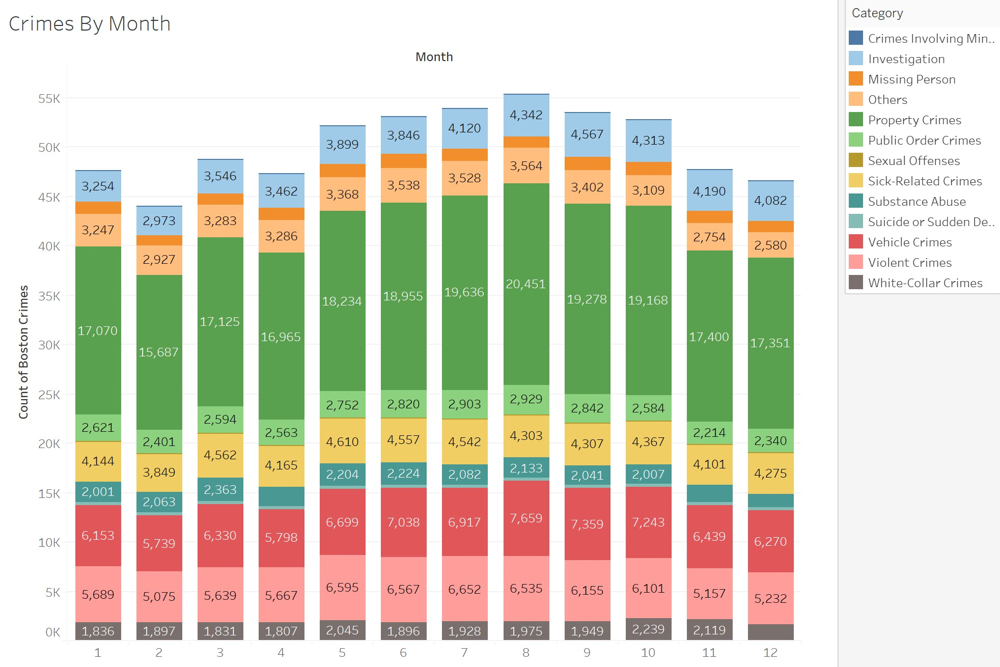

# 2015-2022-Boston-Crime-Analysis

The objective of this project is to explore crime data in Boston, employing data analysis techniques and generating visualizations using both Jupyter Notebook and Tableau. The primary focus is on honing data analysis skills and proficiency in visualization.

## Folder Structure

- **Init Analysis:** Description of the initial analysis for the year 2022.
- **Full Analysis + Tableau Report:** Description of the comprehensive analysis and Tableau report covering 2018-2022.
- **Data:** Explanation of the data folder and the data files it contains.
- **Images:** Explanation of the images folder and any visualizations or images present.

## Sources

Boston Crime reports were obtained here: [Crime Incident Reports in Boston](https://data.boston.gov/dataset/crime-incident-reports-august-2015-to-date-source-new-system)
Boston's Map Data was obtained with the help of Rice University: [Rice University Workshop Files](https://rice.app.box.com/s/njkt1fc8pe1j3dajsccgid3sltoiy4av)

## Results

In terms of district, Roxbury had the largest amount of crimes, while Charlestown had the least. Property Crime contained the highest amount of crime count, while Sexual Offenses had the least amount of crimes. 2017 had the largest amount of crimes, whereas 2020 had the least amount of crimes. In terms of the seasons, Summer had the most crimes while Winter had the least crimes. Lastly, Friday is the weekday that had the most crimes. Sunday had the least crimes within the week.

## Visuals

## Contact

- Sonny Mei
- sonnywcmei@gmail.com
